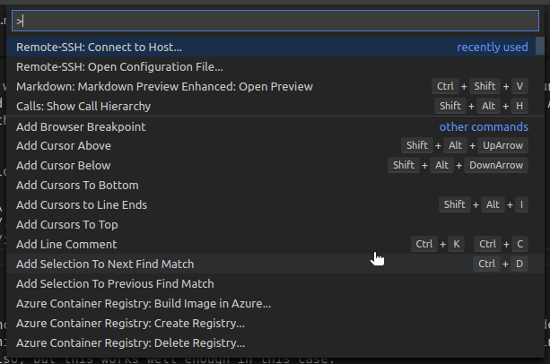
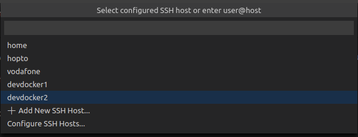
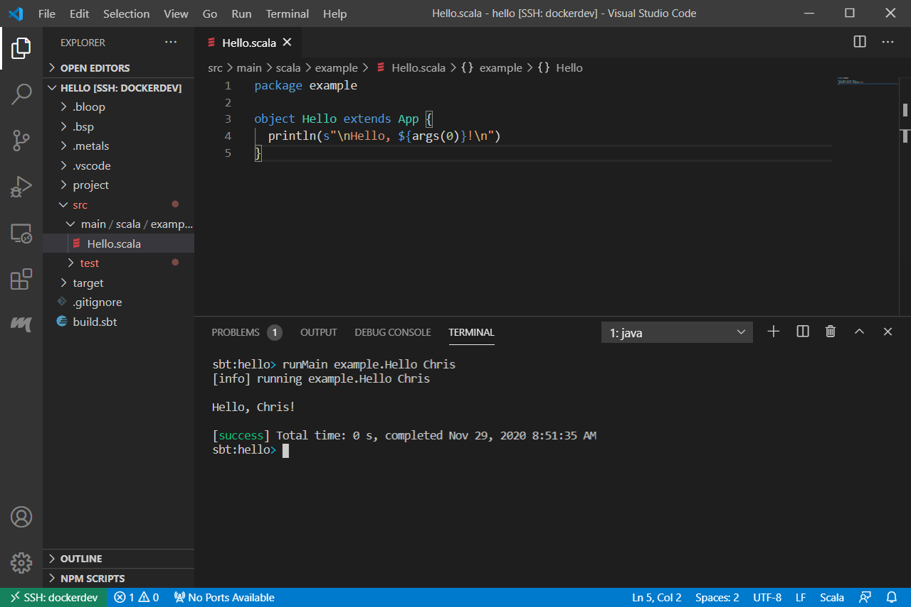
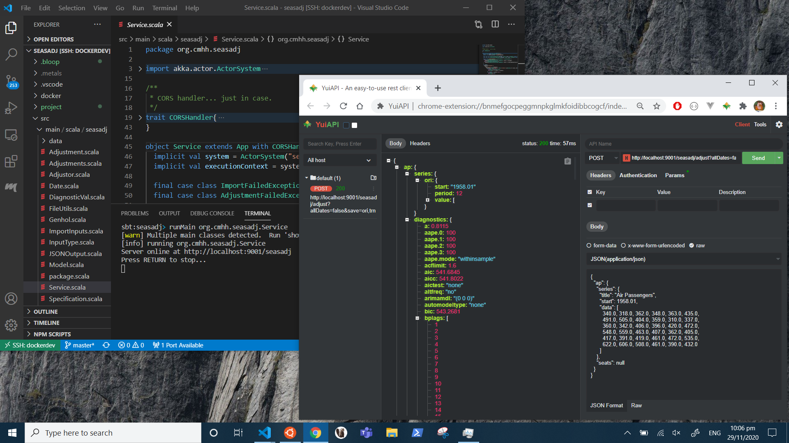
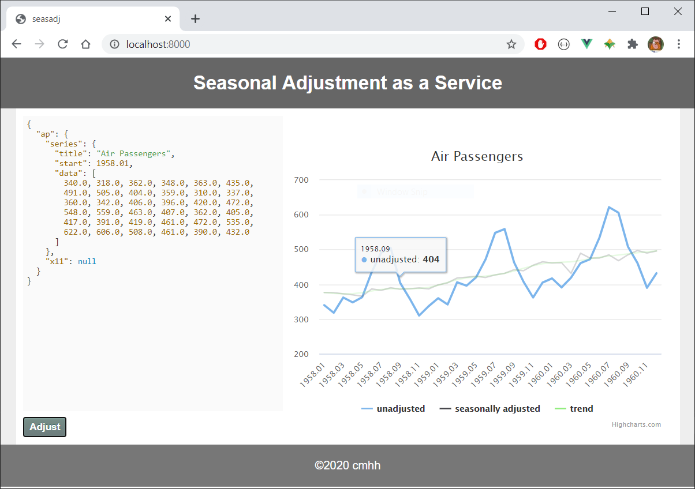

## Working Productively on Windows Using Windows Subsystem for Linux 2 and Docker

A relatively common scenario in enterprise is to provide users a Windows desktop with a relatively small set of tools, and without administrative access.  Depending on the type of work required, this sort of configuration might be perfectly reasonable, but for others it will be productivity-limiting _at best_.

Here we discuss the use of Windows Subsystem for Linux 2 (WSL2), along with Docker, as a means of end-user enablement that might offer a reasonable compromise between safety and productivity.  WSL2 allows Windows users to install a largely feature-complete version of Linux within Windows itself, which can be used 'remotely' via Visual Studio Code (vscode) for almost anything.  Normal users will have administrative rights within the Linux installation, but will not have any heightened access over the host OS itself, meaning users are free to experiment with little risk to the host.

Linux on WSL is a perfectly reasonable sandpit in its own right&ndash;we can experiment as suggested, and if we somehow break the install we can simply blow it away and start again.  Even so, we can choose to use the Linux instance only to build Docker images and run Docker containers, ensuring the Linux system remains free of clutter, while providing yet another layer of abstraction.  That is, we run tools via Docker, which runs via Linux on WSL2, rather than installing those tools in Windows.  The target tools are then accessed remotely via SSH or similar, or via some other client interface, such as a web browser or web service.


## Prerequisites

The goal is to demonstrate that we can make Windows a productive environment in an enterprise setting, with only a minimal set of tools to bootstrap our efforts.  All that is strictly required is:

* WSL2 is enabled on Windows
* Ubuntu 20.04 is installed for WSL2
* Docker is installed on Ubuntu 20.04
* OpenSSH client is enabled on Windows
* Visual Studio Code is installed on Windows
* remote extensions are installed for vscode

WSL2 is available on Windows 10, any edition, build 2004 and up, as well as for Windows Server 2016 and higher.  For more installation details, see [Docker on Windows with Windows Subsystem for Linux 2](https://cmhh.github.io/post/docker_wsl2/).  In an enterprise setting, it would be possible to do most of this in a single powershell script, run as administrator on startup, for example.

## Docker Basics

To create a Docker image, we just need a file called `Dockerfile` containing a complete set of instructions for the build.  That is, a container is (or can be) completely reproducible given only the `Dockerfile`, and so it is often sufficient to manage just this in a version control system.

We'll see `Dockerfile` examples in the following sections, but given such a file, all we need to do to actually create a runnable image called `foo` is to run:

```bash
docker build -t foo <path to Dockerfile>
```

Once created, we can then run instances of the image by running something like the following:

```bash
docker run -d --rm --name mycontainer foo 
``` 

Of course, this is the simplest possible setup, and things can certainly ramp up a bit.  We can copy files from local folders into the image, parameterise the build by using build arguments, add environment variables at runtime, create ad hoc networks for collections of containers, create volumes or mount local folders for persisting data, and more.

## Containers as Generic Development Environments 

Docker containers can be used as isolated development environments.  In an enterprise setting, and with Windows desktops, it is common to block executable files that have not been certified in some way.  However, we can write code, compile it, and run the resulting binaries inside containers, rather than on the host operating system.  Security aside, the approach also proves useful for other reasons.  Namely, it can just be easier to manage a myriad of different build environment, all on a single host.  We can develop standard images for various different use cases&ndash;a container for Java development, or maybe even different containers for different versions of Java or even different build tools (Maven or Gradle, for example), a container for Node.js development, and so on.

Consider the following Dockerfile

```dockerfile
FROM ubuntu:20.04

ENV DEBIAN_FRONTEND=noninteractive

RUN  apt-get update && apt-get -y dist-upgrade && \
  apt-get install -y --no-install-recommends \
    openssh-server openjdk-8-jdk locales apt-transport-https gnupg2 git vim wget curl xz-utils ca-certificates \
    build-essential gfortran && \
  sed -i -e 's/# en_US.UTF-8 UTF-8/en_US.UTF-8 UTF-8/' /etc/locale.gen && \
  dpkg-reconfigure --frontend=noninteractive locales && \
  update-locale LANG=en_US.UTF-8 && \
  echo "deb https://dl.bintray.com/sbt/debian /" | tee -a /etc/apt/sources.list.d/sbt.list && \
  curl -sL "https://keyserver.ubuntu.com/pks/lookup?op=get&search=0x2EE0EA64E40A89B84B2DF73499E82A75642AC823" | apt-key add && \
  apt-get update && apt-get install -y sbt && \
  curl https://packages.microsoft.com/config/ubuntu/20.04/packages-microsoft-prod.deb --output packages-microsoft-prod.deb && \
  dpkg -i packages-microsoft-prod.deb && \
  curl https://nodejs.org/dist/v14.15.1/node-v14.15.1-linux-x64.tar.xz --output node-v14.15.1-linux-x64.tar.xz && \
  tar -xf node-v14.15.1-linux-x64.tar.xz && \
  mv node-v14.15.1-linux-x64 /usr/local/node && \
  echo "export PATH=$PATH:/usr/local/node/bin" >> /etc/bash.bashrc && \
  rm node-v14.15.1-linux-x64.tar.xz && \
  apt-get update && apt-get install -y dotnet-sdk-5.0 && \
  rm packages-microsoft-prod.deb && \
  apt-get clean && \
  rm -rf /var/lib/apt/lists/* 

  EXPOSE 22
  
  CMD mkdir -p /root/.ssh && \
    echo "$PUB_KEY" >> /root/.ssh/authorized_keys && \
    echo "$PUB_KEY" >> /root/.ssh/id_rsa.pub && \
    echo "$PRIVATE_KEY" >> /root/.ssh/id_rsa && \
    chmod 700 /root/.ssh && chmod 600 /root/.ssh/* && \
    service ssh start && \
    tail -f /dev/null  
```

Those accustomed to working on Linux will find the content of the file relatively straightforward, but in summary the file does the following:

* installs the usual GNU compiler suite
* installs OpenJDK 8 for Java development
* installs git so we can work with git repositories
* installs sbt, a Java and Scala build tool
* installs .NET 5.0 for C# 9 and F# 5 development, including ASP.NET web applications
* installs Node.js for JavaScript development
* installs OpenSSH server so the container can be accessed remotely

To build the container from the [development](docker/development) directory:

```bash
docker build -t development .
```

and to run an instance:

```bash
docker run -d --rm --name development \
  -v $PWD/.ivy2:/root/.ivy2 \
  -v $PWD/.cache:/root/.cache \
  -v $PWD/.npm:/root/.npm \
  -v $PWD/.vscode-server:/root/.vscode-server \
  -e "PUB_KEY=$(cat $HOME/.ssh/id_rsa.pub)" \
  -e "PRIVATE_KEY=$(cat $HOME/.ssh/id_rsa)" \
  -p 23:22 -p 9001:9001 -p 5001:5001 -p 3001:3001 \
  development
```

In this case, we copy our keys to the container _at runtime_ so that we can connect without a password via a standard SSH client.  In particular, we add the following to our SSH config:

```
Host dockerdev
  HostName localhost
  Port 23
  User root
```

and we can then use Visual Studio Code to develop in the usual way, but using the running container:







And provided the right ports are open, we can test web services and so forth locally also:



## Deployment via Containers

Applications are routinely deployed using containers.  In this case, we run a simple [seasonal adjustment service](https://github.com/cmhh/seasadj).  The `Dockerfile` is as follows:

```Dockerfile
FROM ubuntu:20.04

ENV DEBIAN_FRONTEND noninteractive
ENV SHELL /bin/bash

RUN  apt-get update && apt-get -y dist-upgrade && \
  apt-get install -y --no-install-recommends ca-certificates openjdk-8-jre-headless wget gfortran make && \
  mkdir -p /tmp/x13 && \
  cd /tmp/x13 && \
  wget https://www.census.gov/ts/x13as/unix/x13ashtmlsrc_V1.1_B39.tar.gz && \
  tar -xvf x13ashtmlsrc_V1.1_B39.tar.gz && \
  make -j20 -f makefile.gf && \
  mv x13asHTMLv11b39 /usr/bin/x13ashtml && \
  cd / && \
  rm -fR /tmp/x13 && \
  wget https://github.com/cmhh/seasadj/releases/download/0.1.0-SNAPSHOT/seasadj.jar && \
  apt-get remove -y wget gfortran make && \ 
  apt-get autoremove -y && \
  apt-get clean && \
  rm -rf /var/lib/apt/lists/* 

EXPOSE 9001

ENTRYPOINT ["java", "-cp", "/seasadj.jar", "org.cmhh.seasadj.Service"]
```

In this example, we simply create a basic instance with a Java runtime, and download an [artefact](https://github.com/cmhh/seasadj/releases/download/0.1.0-SNAPSHOT/seasadj.jar) from GitHub to serve as our entrypoint.  Note that the service itself also requires [X13-ARIMA-SEATS](https://www.census.gov/srd/www/x13as/) be present, so we download the source and compile it as part of the image build. 

As usual, the container is built as follows:

```bash
docker built -t seasadj .
```

and run as follows:

```bash
docker run -td --rm --name seasadj -p 9001:9001 seasadj
```

The service is stateless.  It accepts one or more input specifications as a JSON array, and returns seasonally adjusted data in the same format.  For example, to adjust the following JSON input:

```json
{
  "ap": {
    "series": {
      "title": "Air Passengers",
      "start": 1958.01,
      "data": [
        340.0, 318.0, 362.0, 348.0, 363.0, 435.0, 
        491.0, 505.0, 404.0, 359.0, 310.0, 337.0, 
        360.0, 342.0, 406.0, 396.0, 420.0, 472.0, 
        548.0, 559.0, 463.0, 407.0, 362.0, 405.0, 
        417.0, 391.0, 419.0, 461.0, 472.0, 535.0, 
        622.0, 606.0, 508.0, 461.0, 390.0, 432.0
      ]
    },
    "x11": null
  }
}
```

we could use CURL as follows:

```bash
curl \
  -X POST \
  -H "Content-Type: application/json" \
  -d @airpassengers.min.json \
  localhost:9001/seasadj/adjust \
  --compressed --output airpassengers.output.json
```

We could even build a SPA.  The following is a screenshot of a basic app written using Vue.js, for example:



Under basic load testing, the service could handle around 230 transactions per second on a laptop with an 8 core AMD Ryzen 5 2500U with Radeon Vega Mobile Gfx 2.00 GHz processor.  And while no security is provided directly, authentication methods can be added easily if required, and communication can be encrypted easily enough using Nginx or similar.

## Databases via Containers

Fully functional versions of popular databases are often available via official Docker images, both relational and NoSQL alike.  For development purposes, containerised databases will generally suffice, and can be run in a completely local context.

Consider the following `Dockerfile`, a modified version of [adventureworks-docker](https://github.com/robyvandamme/adventureworks-docker), which provides a containerised version of Microsoft SQL Server with the popular AdventureWorks database pre-loaded:

```Dockerfile
FROM mcr.microsoft.com/mssql/server

WORKDIR /setup

COPY ./setup .

CMD /bin/bash ./entrypoint.sh
```

This is very simple, though does depend on a large SQL script, `setup-db.sql`.  To build:

```bash
docker build -t adventureworks .
```

To run an instance:

```bash
docker run -d --rm \
  --name adventureworks \
  -e 'ACCEPT_EULA=Y' \
  -e 'MSSQL_SA_PASSWORD=password-1234' \
  -p 1431:1431 \
  -p 1432:1432 \
  -p 1433:1433 \
  adventureworks
```

Once running, one can then connect using database clients such as the excellent [DBeaver](https://dbeaver.com/):


The database provided is a full-featured version of SQL Server, and so is sufficient for local development, but also general purpose testing.  Want to know what sort of performance improvement would be achieved with the addition of a columnstore index?  You can test the locally&ndash;no need to appeal to a physical or remote test environment, certainly if one doesn't already exist, or if a process must be followed to be granted access. 

## Analytics via Containers

Containers can be used to house any manner of analytical environment, from R with RStudio, to JupyterLab with a variety of kernels, and even to a fully-functional, if not highly performing, Big Data stack.

Consider the following `Dockerfile`:

```Dockerfile
ARG ubuntu_version=20.04

FROM ubuntu:$ubuntu_version

ARG cores=12
ARG r_version=4.0.3
ARG rstudio_version=1.4.1032
ENV DEBIAN_FRONTEND=noninteractive
ENV SHELL=/bin/bash

RUN  apt-get update && apt-get -y dist-upgrade && \
  apt-get install -y --no-install-recommends \
    gnupg2 dirmngr ca-certificates build-essential \
    libcairo2-dev '^perl-modules-[0-9].[0-9]+$' \
    libssl-dev libgit2-dev libcurl4-gnutls-dev libxml2-dev curl wget htop locales \
    openjdk-8-jdk python3-pip git vim libudunits2-dev \
    grass gdal-bin libgdal-dev libgeos-dev libproj-dev proj-bin proj-data \
    libblas3 libatlas-base-dev liblapack-dev libreadline-dev gfortran \
    libx11-dev libxt-dev zlib1g-dev libbz2-dev liblzma-dev libpcre2-dev \
    sudo lsb-release gdebi-core psmisc libclang-dev libapparmor1 && \
  apt-get clean && \
  rm -rf /var/lib/apt/lists/* && \
  sed -i -e 's/# en_US.UTF-8 UTF-8/en_US.UTF-8 UTF-8/' /etc/locale.gen && \
  dpkg-reconfigure --frontend=noninteractive locales && \
  update-locale LANG=en_US.UTF-8 && \
  wget -qO- "https://yihui.org/gh/tinytex/tools/install-unx.sh" | sh -s - --admin --no-path && \
  mv /root/.TinyTeX /usr/local/TinyTex && \
  /usr/local/TinyTex/bin/*/tlmgr path add && \
  mkdir /src && \
  cd /src && \
  wget https://cran.r-project.org/src/base/R-$(echo $r_version | cut -d'.' -f 1)/R-${r_version}.tar.gz && \
  tar -xvf R-${r_version}.tar.gz && \
  cd /src/R-${r_version} && \
  ./configure --enable-R-shlib --with-blas --with-lapack --enable-memory-profiling --with-cairo && \
  make -j $cores && make install && \
  ln -s /usr/local/lib/R/bin/R /usr/bin/R && \
  ln -s /usr/local/lib/R/bin/Rscript /usr/bin/Rscript && \
  cd / && rm -fR src && \
  echo "local({\n  r <- getOption('repos')\n  r['CRAN'] <- 'https://cloud.r-project.org'\n  options(repos = r)\n})" > /usr/local/lib/R/etc/Rprofile.site && \
  echo "\noptions('bitmapType' = 'cairo')" >> /usr/local/lib/R/etc/Rprofile.site && \
  echo "PATH=/usr/local/sbin:/usr/local/bin:/usr/sbin:/usr/bin:/sbin:/bin" > /usr/local/lib/R/etc/Renviron.site && \
  R -e "install.packages('renv')" && \
  wget https://s3.amazonaws.com/rstudio-ide-build/server/bionic/amd64/rstudio-server-${rstudio_version}-amd64.deb && \
  gdebi --non-interactive rstudio-server-${rstudio_version}-amd64.deb && \
  rm rstudio-server-${rstudio_version}-amd64.deb
  
RUN adduser --disabled-password --gecos "" guest && \
  usermod --password $(openssl passwd -1 guest) guest && \
  usermod -aG sudo guest 

EXPOSE 8787

CMD service rstudio-server start && \
  tail -f /dev/null
```

The `Dockerfile` accepts build arguments, so images containing different versions of R, for example, can be created from the same set of instructions.  For example:

```bash
docker build -t rstudio:4.0.3 --build-arg r_version=4.0.3 .
```

To run a container with the image:

```bash
docker run -d --rm \
  --name rstudio \
  -p 8787:8787 \
  -v ${PWD}/.local:/home/guest/.local \
  rstudio:4.0.3
```


## Using a Registry

Consider the analytics example above, consisting of a containerised R environment.  Such an image might well be of value to an entire group of analysts, so rather than provide a `Dockerfile` that each person can use to build their own image we could build the image once and then push it to a central registry for anybody to use.

We use Docker compose to create a very simple example using a local registry and a [basic web-based UI](https://github.com/Joxit/docker-registry-ui).  Consider the following, which we save as `docker-compose.yml`:

```yaml
version: "3.8"
services:
  registry:
    image: registry:2
    ports:
      - 5000:5000
    volumes:
      - ./registry-data:/var/lib/registry
    networks:
      - registrynet
  ui:
    image: joxit/docker-registry-ui:static
    ports:
      - 8080:80
    environment:
      - REGISTRY_TITLE=Local Docker Registry
      - REGISTRY_URL=http://registry:5000
    depends_on:
      - registry
    networks:
      - registrynet
networks:
  registrynet:
```

This describes the coordination of two containers as a single registry setup, and can be run as follows:

```bash
docker-compose up -d
```

The R image build earlier can be tagged and pushed to the registry as follows:

```bash
docker tag rstudio:4.0.3 localhost:8080/rstudio:4.0.3
docker push localhost:8080/rstudio:4.0.3
```

The UI itself will be available in our web browser at `localhost:8080`:


# Summary

WSL2 lets us use a Windows machine for any manner of local development and analytics.  A Linux instance running via WSL2 gives us a degree of isolation, and so is relatively safe&ndash;perhaps no less safe than allowing the local use of something like Python.  We can ramp up the isolation by using the Linux instance exclusively to build Docker images and run Docker containers.  Besides, using containers dramatically simplifies application deployment, and is relatively standard at this point, and so is a useful skill to develop.

Having access to a Linux instance, and having the ability to build and run container images, means there's almost nothing we couldn't build or test locally, so with little cost or administrative drag.  The use cases here are by no means exhaustive, but we can:

* use containers to build and test applications locally
* use containers to test deployment of applications
* use containers to house (possibly ephemeral) database instances
* use containers to run or test analytical / data science platforms
* and much more!