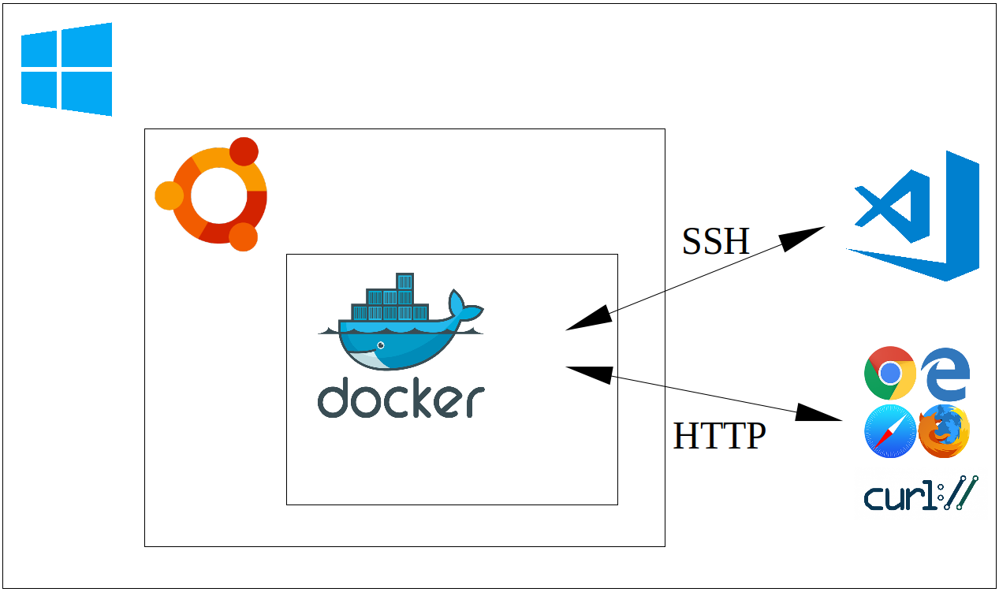

## Working Productively on Windows Using Windows Subsystem for Linux 2 and Docker

A relatively common scenario in enterprise is to provide users with a Windows desktop with a relatively small set of tools, and without administrative access.  Depending on the type of work required, this sort of configuration might be perfectly reasonable, but for others it will be productivity-limiting at best.

Here we discuss the use of Windows Subsytem for Linux 2 (WSL2), along with Docker, as a means of end-user enablement that might offer a reasonable compromise between safety and productivity.  WSL2 allows Windows users to install a largely feature-complete version of Linux within Windows itself, which can be used 'remotely' via Visual Studio Code (vscode) for almost anything.  However, here we use the Linux instance purely to build Docker images and run Docker containers, ensuring the Linux system remains free of clutter, while providing yet another layer of abstraction.  That is, we run tools via Docker, which runs via Linux on WSL2, rather than installing those tools in Windows.  The target tools are then accessed remotely via SSH or similar, or via some other client interface, such as a web browser or web service.

## Prerequisites

## Containers as Generic Development Environments

## Deployment via Containers

## Databases via Containers

## Analytics via Containers

## Using a Registry