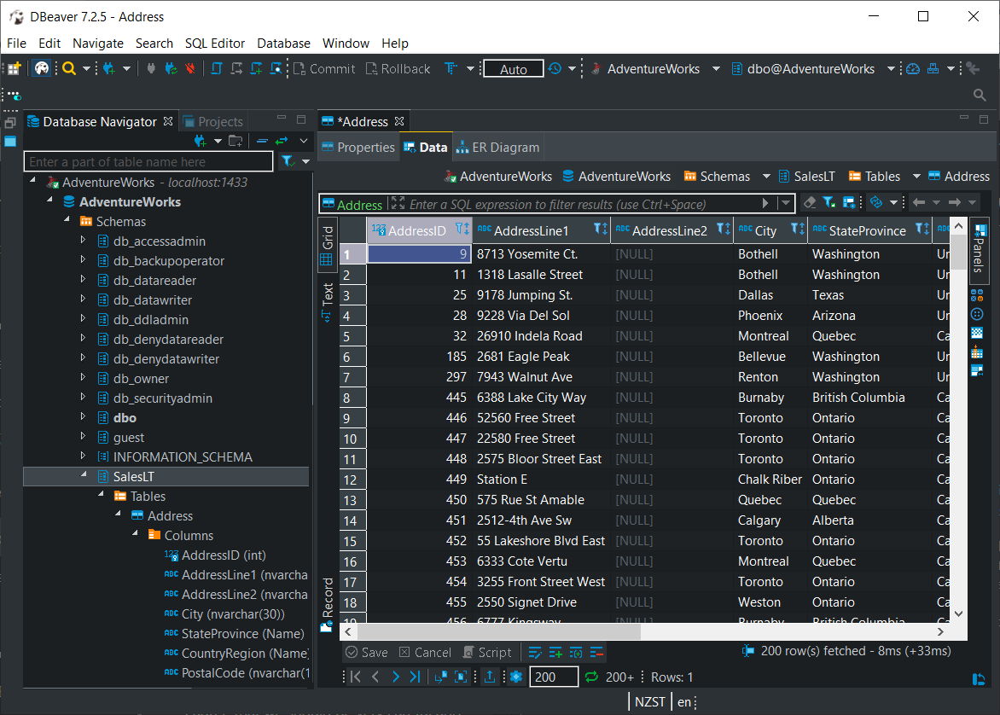

## Microsoft SQL Server with `AdventureWorks` Database

`AdventureWorks` database for testing purposes based on the [microsoft/mssql-server-linux](https://hub.docker.com/r/microsoft/mssql-server-linux/) image. Will re-create the `AdventureWorks` database on every run.

To build the image from the adventureworks folder, run:

```bash
docker build -t adventureworks .
```

To start an instance run:

```bash
docker run -d --rm \
  --name adventureworks \
  -e 'ACCEPT_EULA=Y' \
  -e 'MSSQL_SA_PASSWORD=password-1234' \
  -p 1431:1431 \
  -p 1432:1432 \
  -p 1433:1433 \
  adventureworks
```

I had trouble connecting to this database via SQL Server Management Studio on Windows.  I'm not a heavy Windows user, and spent not time trying to figure this out.  However, I could connect no problem using [dbeaver](https://dbeaver.com/) (which uses a JDBC driver, rather than ODBC):


