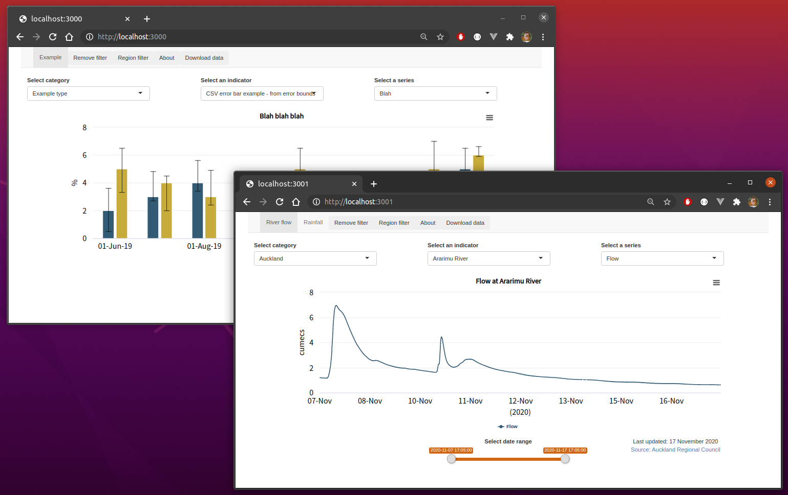

To build the container from the `dashboard` folder:

```bash
docker build -t dashboard .
```

The `dashboard` folder contains examples in subdirectories under `examples`.  To run an instance using `ex1` on host port 3000:

```bash
docker run -d --rm \
  --name dashboard1 \
  -v $PWD/ex1/config:/data_portal/config \
  -v $PWD/ex1/data:/data_portal/data \
  -v $PWD/ex1/www:/data_portal/www \
  -p 3000:3000 \
  dashboard
```

To run an instance using `ex2` on host port 3001:

```bash
docker run -d --rm \
  --name dashboard2 \
  -v $PWD/ex2/config:/data_portal/config \
  -v $PWD/ex2/www:/data_portal/www \
  -v $PWD/ex2/data:/data_portal/data \
  -p 3001:3000 \
  dashboard
```


