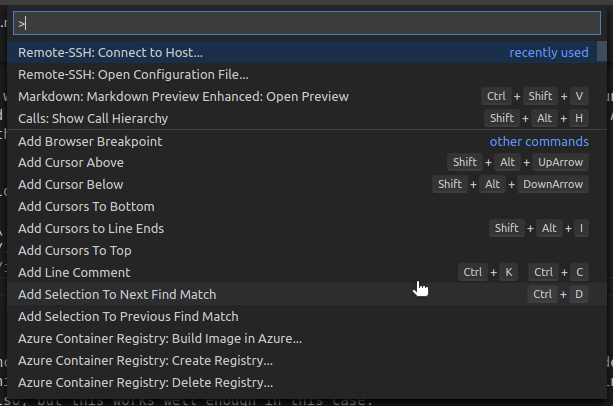
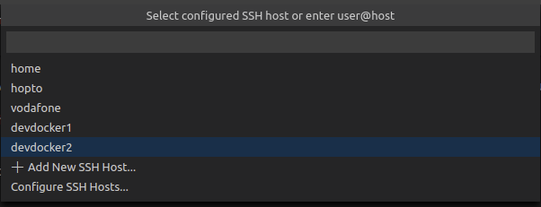
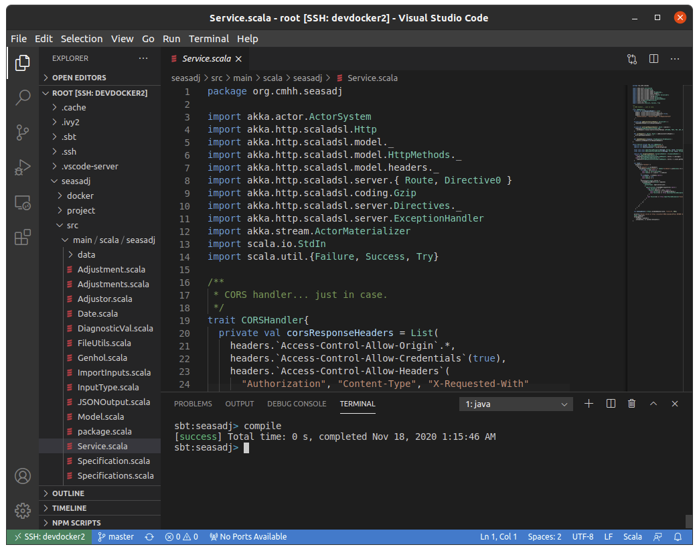

## Dev Container

This container contains Ubuntu 20.04 with OpenJDK-8 and .NET installed, along with sbt for building Scala or Java projects, and Node.jse.  The image will also contain a running SSH server so that it can be accessed remotedly.  To build the container from within the `development` directory:

```bash
docker build -t development .
```

When running the container, if we wish to connect via SSH, we need to pass in our publish SSH key at runtime via the environment variable `PUB_KEY`.  Doing it at runtime means that our compiled image does not contain our key, which would obviously be problematic.  Assuming our public key is contained in `$HOME/.ssh/id_rsa.pub`, we start an instance of the image as follows:

```bash
docker run -d --rm --name development \
  -v $PWD/.ivy2:/root/.ivy2 \
  -v $PWD/.cache:/root/.cache \
  -v $PWD/.npm:/root/.npm \
  -v $PWD/.vscode-server:/root/.vscode-server \
  -e "PUB_KEY=$(cat $HOME/.ssh/id_rsa.pub)" \
  -p 23:22 \
  developmentdocker rmi $(docker images --format '{{.Repository}}:{{.Tag}}' | grep 'imagename')
```

Add other ports as required.  For example, if you're going to run a Node app on port 3000 then add `-p 3000:3000`.  This command also persists a number of caches for the sake of productivity, though it is not required.

## Connect with Visual Studio Code

If we want to connect to this container from Visual Studio Code on Linux, we can find the container IP address vi `docker inspect development`.  It will be something like `172.17.0.2`, depending which other containers are running.  We can then connect using something like `ssh root@172.17.0.2`.  We cannot connect directly this way from Windows, and we'd instead need to use something like `ssh root@localhost -p 23`.  

In my case, Visual Studio Code refuses to connect without a password unless the connection details are stored in the users' home directory in the file `.ssh/config`.  For example:

```as.is
Host devdocker
  HostName localhost
  Port 23
  User root
```








## Simple sbt Project

To create a minimal Scala application, run:

```bash
sbt new scala/scala-seed.g8
```

You will be prompted to name your project, and the resulting project will be placed in a directory with the chosen name.  Enter the new directory and type `sbt` to get access to an interactive sbt session.  To run the project enter:

```bash
cd
sbt "runMain example.Hello"
```

## Simple .NET Project

To create a minimal .NET Core application, run:

```bash
dotnet new console -o hellocsharp
```

This will create a folder called `hellocsharp`.  To run:

```bash
cd
dotnet run
```