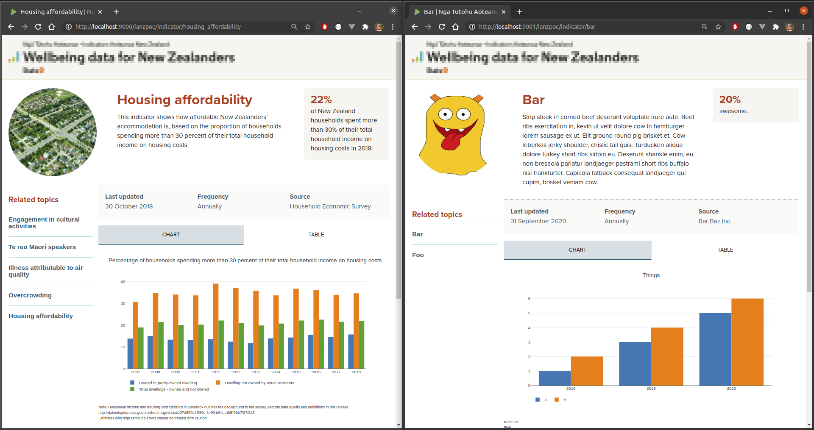

## Indicators via a Templated Website

The IANZ container runs a simple website consisting mainly of a single templated page, `/indicator/:indicator`.  To build from the `ianz` folder:

```bash
docker build -t ianz .
```

The information required for the indicators exists in the folder, `/ianz/indicators`, which must be mounted on startup.  For example:

```bash
docker run -td --rm \
  --name ianz \
  -p 9000:9000 \
  -v ${PWD}/examples/ex1:/ianz/indicators \
  ianz 
```

To add a new indicator, we put 4 files containing data, metadata, configuration, and a thumbnail image in the `indicators` folder.  All the files are parsed and added to a single in-memory database.  This is far from perfect as a setup, but it was the method that allowed files from the existing IANZ website to be used with relatively litte change.



As a quick performance test:

```bash
$ siege -b -c 12 -t 30s http://localhost:9000/ianzpoc/indicator/te_reo_maori_speakers
```
```as.is
** SIEGE 4.0.7
** Preparing 12 concurrent users for battle.
The server is now under siege...
Lifting the server siege...
Transactions:                  36350 hits
Availability:                 100.00 %
Elapsed time:                  29.19 secs
Data transferred:           10051.20 MB
Response time:                  0.01 secs
Transaction rate:            1245.29 trans/sec
Throughput:                   344.34 MB/sec
Concurrency:                   11.46
Successful transactions:       36350
Failed transactions:               0
Longest transaction:            1.03
Shortest transaction:           0.00
```