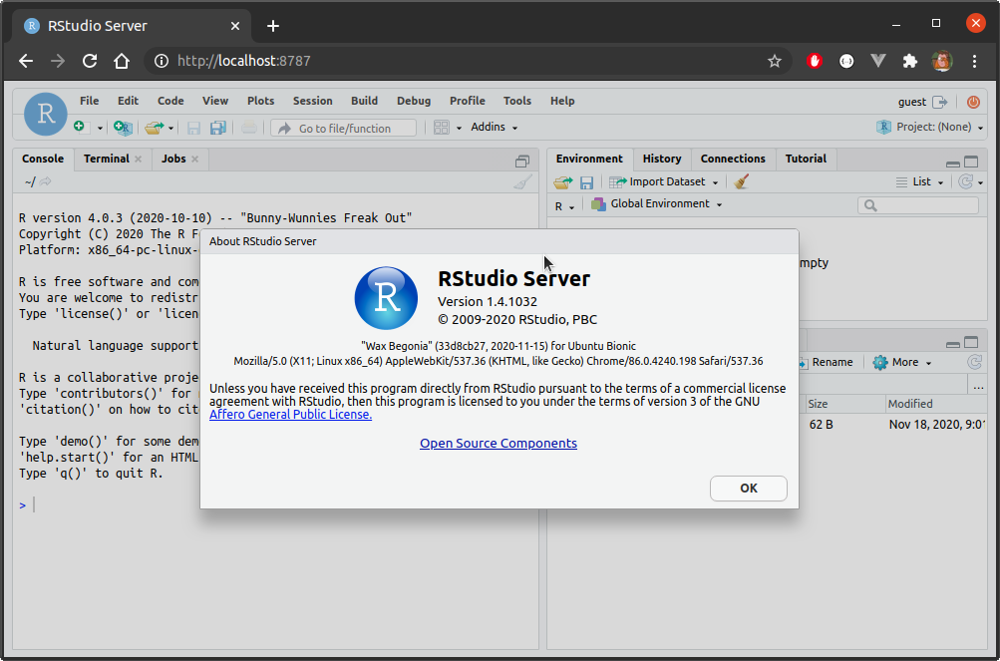

This image contains R and RStudio Server, along with a range of spatial dependencies, and a minimal $\LaTeX$ distribution.  To build from within the `rstudio` folder:

```bash
docker build -t rstudio .
```

The container takes build arguments `cores`, `ubuntu_version`, and `r_version`, and `rstudio_version`.  R is built from source, and `cores` controls how many cores are used when compiling, and defaults to 12.  `r_version` and `rstudio_version` are self-explanatory, and default to `4.0.3` and `1.4.1032`, respectively.  `ubuntu_version` is also self-explanatory, and defaults to `20.04`.  However, straying too far either direction of `20.04` will probably cause things to break.  

To build an image with R version 3.6.3, for example, run:

```bash
docker build \
  --build-arg r_version=3.6.3 \
  -t rstudio:ubuntu20.04-3.6.3 \
  .
```

To run an instance:

```bash
docker run -d --rm --name rstudio01 \
  -p 8787:8787 \
  -v ${PWD}/.local:/home/guest/.local \
  -v ${PWD}/work:/home/guest/work \
  rstudio
```

